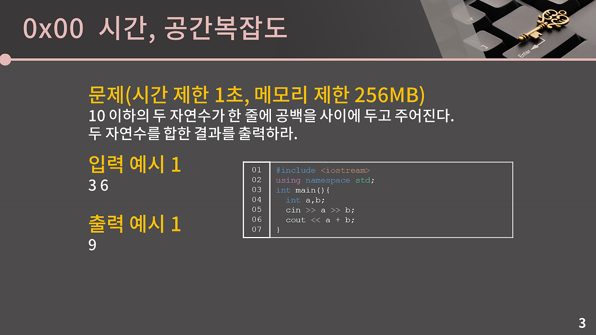

# [0x01강] 기초 코드 작성 요령 Ⅰ

기한 경과: ⏰ Past Due
상태: 완료
수강일: 08/18/2025
우선순위: 높음
작업 유형: 💅 다듬기
노력 수준: 보통
설명: 최신 제품 제공사항을 더 잘 반영하도록 헤더 텍스트를 변경합니다.

### 0x00 시간, 공간복잡도

- 시간복잡도
    
    
    
    ```cpp
    int func1(int arr[], int n){
    	int cnt = 0;                    연산 1번 - cnt 변수 선언, 0 대입
    	for(int i=0; i<n; i++){         연산 1번 - i에 초기값으로 0 대입
    			                            연산 2번 - i가 n보다 작은지 확인, 작은 경우 1 증가	        
    		if(arr[i] % 5 == 0) cnt++;    연산 2번 - 5로 나눈 나머지 계산, 0과 일치하는지 확인
    								                  연산 2번 - 5의 배수이면 cnt 1 증가
    	} 
    	return cnt;                     연산 1번 - cnt 반환                     
    }
    ```
    
    ⇒ 총 연산 횟수 : 1+1+n*(2+2+1)+1 = 5n+3 → n에 비례
    
    
    
    
    
    
    
    시간복잡도 ⇒ 빅오표기법의 형태로 나타냄
    
    
    
    
    
    
    
    ```cpp
    #include <iostream>
    using namespace std;
    
    int func1(int N){
    	int ret=0;
    	for(int i=1; i<=N; i++){
    		if(i%3==0 || i%5==0) ret+=i;
    	}
    	return ret;
    }	
    ```
    
    ⇒ 시간복잡도 = O(N)
    
    
    
    ```cpp
    #include <iostream>
    using namespace std;
    
    int func2(int arr[], int N){
    	for(int i=0; i<=N; i++)
    		for(int j=i+1; j<N; j++)
    			if(arr[i]+arr[j] == 100) return 1;
    	return 0;
    }	
    ```
    
    ⇒ 시간복잡도 : (N-1)+(N+2)+…+3+2+1 = $(N^2-N)/2$
    
    ⇒ $O(N^2)$
    
    
    
    ```cpp
    #include <iostream>
    using namespace std;
    
    int func3(int N){
    	for(int i=1; i*i<=N; i++){
    		if(i*i==N) return 1;
    	}
    	return 0;
    }	
    ```
    
    ⇒ 시간복잡도 : $O(\sqrt N)$
    
    
    
    ```cpp
    #include <iostream>
    using namespace std;
    
    int func4(int N){
    	int val=1;
    	while(2*val<=N) val*=2;
    	return val;
    }	
    ```
    
    ⇒ 시간복잡도 : $O(log N)$
    
- 공간복잡도
    
    
    

### 0x01 정수 자료형


int가 longlong 보다 연산 속도와 메모리 모두 우수하지만, 80번째 피보나치 수를 구하는 문제와 같이 int 자료형이 표현할 수 있는 범위를 넘어서는 수를 저장해야 하면 반드시 **longlong** 자료형 사용. 


2진수, 10진수 모두 제대로 계산됨


2진수, 10진수 모두 제대로 계산됨


01111111 + 1 = 10000000
 $-2^7$의 칸 ⇒ 10000000 = -128 
127+1 = -128 ⇒ Integer Overflow


오류 피하려면 전부 int 말고 longlong 으로 쓰는 것도 방법.

### 0x02 실수 자료형

#실수 자료형
- float (4 byte)
- double (8 byte)


sign field : 해당 수가 음수인지 양수인지 저장하는 필드

exponent field : 과학적 표기법에서의 지수를 저장하는 필드

fraction field : 유효숫자 부분을 저장하는 필드

각 필드의 크기 - float : 1, 8, 23 bit
                          - double : 1, 11, 52 bit


이렇게 실수를 저장하는 방식 : IEEE-754 format

### 실수의 성질


0.1+0.1+0.1 ≠ 0.3
→ 유효숫자가 들어가는 fraction field가 유한하기 때문에 2진수 기준으로 무한소수인걸 저장하려고 할 때에는 어쩔 수 없이 float은 앞 23 bit, double은 앞 52 bit까지만 잘라서 저장할 수 밖에 없음.
→ 0.1은 이진수로 나타내면 무한소수여서 애초에 오차가 있는 채로 저장이 됐고 그걸 3번 더하다보니 오차가 더 커져서 위 코드 결과처럼 됨.
⇒ fraction field에서 각 자료형이 정확하게 표현할 수 있는 범위
     - float : 유효숫자 6자리
     - double : 유효숫자가 15자리
     ⇒ float은 상대 오차 10-6까지 안전, double은 10-15까지 안전.
* 상대 오차가 10-15까지 안전하다 : 원래 참값이 1이라고 할 때, 1-10-15 에서 1+10-15 사이의 값을 가진다는게 보장된다는 의미
⇒ 즉, 오차가 생기는 것 자체는 막을 수가 없지만 오차가 어느 정도인지는 알 수 있음.

- 상대 오차의 허용 범위에서 볼 수 있듯 두 자료형끼리 차이가 굉장히 크기 때문에 실수 자료형이 필요하면 꼭 float 대신 double 써야함.
- 실수 자료형은 필연적으로 오차가 있으니까 실수 자료형이 필요한 문제면 보통 문제에서 절대/상대 오차를 허용한다는 단서 줌. but, 만약 이런 표현이 없다면 실수를 안쓰고 모든 연산을 정수에서 해결할 수 있는 문제일 것.


double은 유효숫자가 15자리인데 long long은 최대 19자리니까 $10^{18}+1$과 $10^{18}$ 구분 불가. 같은 값 저장됨. 
즉, double에 long long 범위의 정수를 담을 경우 오차가 섞인 값이 저장될 수 있음. 다만 int는 최대 21억이기 때문에 double에 담아도 오차가 생기지 않음. 


0.1+0.1+0.1≠ 0.3 에서 봤듯,오차 때문에 두 실수가 같은지 알고 싶을 때에는 둘의 차이가 아주 작은 값, 대략 $10^{-12}$ 이하면 동일하다고 처리를 하는게 안전.

5번째 줄의 $1e-12=10^{-12}$

ex) $10^9=1000000000=1e9$